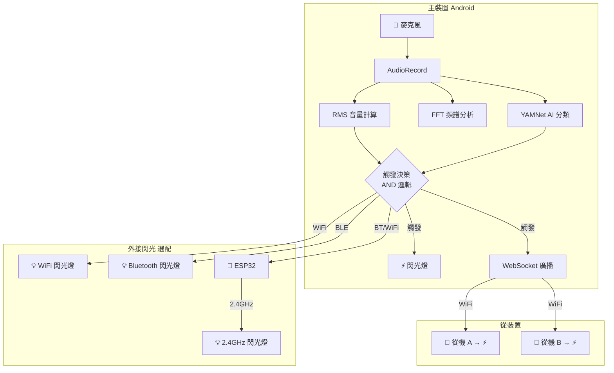

# Flashback — 飆車聲音偵測與閃光嚇阻系統

**利用 AI 辨識飆車噪音，自動觸發閃光燈模擬測速照相，嚇阻深夜飆車族。**

台灣都市深夜飆車問題嚴重，改裝車輛炸街聲音超過 100dB，嚴重影響居民生活品質。Flashback 是一套**低成本、自動化、民間可自行架設**的聲音偵測與閃光嚇阻裝置，利用舊 Android / iOS 手機即可運作，透過飆車族對「被拍照」的心理恐懼達到嚇阻效果。

---

## 功能特色

| 功能 | 狀態 |
|------|------|
| Android App 基礎框架（Jetpack Compose） | [已實作] |
| 持續監聽環境音（AudioRecord PCM 串流） | [計畫中] |
| 即時音量計算（RMS dB） | [計畫中] |
| FFT 頻譜分析（100Hz ~ 3kHz 引擎聲特徵） | [計畫中] |
| YAMNet AI 聲音分類辨識 | [計畫中] |
| AND 邏輯觸發條件（音量 + AI + 持續時間 + 時段） | [計畫中] |
| 手機閃光燈觸發（延遲 < 100ms） | [計畫中] |
| 多機 WebSocket 聯動閃光 | [計畫中] |
| 參數設定介面（閾值、時段、靈敏度） | [計畫中] |
| 觸發事件記錄與歷史查看 | [計畫中] |
| 觸發時自動拍照存檔 | [選配] |
| Telegram Bot 通報 | [選配] |
| 外接閃光燈 — WiFi 直連（閃光燈內建 WiFi） | [選配] |
| 外接閃光燈 — Bluetooth 直連（閃光燈內建 BLE） | [選配] |
| 外接閃光燈 — 2.4GHz 經 ESP32 橋接（Phone → BT/WiFi → ESP32 → 2.4GHz → Flash） | [選配] |
| iOS App（Swift / SwiftUI） | [計畫中] |

## 系統架構概覽



## 快速開始

### 方式一：Docker Devcontainer（推薦）

1. 安裝 [Docker](https://www.docker.com/) 與 [VS Code](https://code.visualstudio.com/)
2. 安裝 VS Code 擴充套件 [Dev Containers](https://marketplace.visualstudio.com/items?itemName=ms-vscode-remote.remote-containers)
3. 開啟專案資料夾，VS Code 會提示在容器中重新開啟
4. 容器已預裝 JDK 17、Gradle 8.11.1、Android SDK 35

### 方式二：Tart macOS VM（iOS 開發）[計畫中]

1. 在 macOS 主機安裝 [Tart](https://tart.run/)（Apple Silicon 原生虛擬化）
2. 建立 macOS VM 並安裝 Xcode
3. 透過 VS Code + SSH Remote 連線至 VM 開發
4. 體驗與 devcontainer 相同的遠端開發流程，差別僅在需從 macOS 載入 VS Code

> iOS 版本尚未開始開發，此方式為未來規劃。

### 方式三：本地環境

**前置需求：**
- JDK 17
- Android SDK（Platform 35, Build Tools 35.0.0）
- 設定環境變數 `ANDROID_HOME`

```bash
git clone <repository-url>
cd flashback
```

## 建置指令

```bash
# 建置 Debug APK
./gradlew assembleDebug

# 執行 Lint 檢查
./gradlew lint

# 清除建置產物
./gradlew clean

# 執行單元測試（尚未建立）
./gradlew test
```

建置產物位於 `app/build/outputs/apk/debug/`。

## 專案結構

```
flashback/
├── app/                          # Android App 模組
│   ├── build.gradle.kts          # App 建置設定
│   └── src/main/
│       ├── AndroidManifest.xml
│       └── java/com/flashback/app/
│           ├── MainActivity.kt   # 主 Activity
│           └── ui/theme/         # Compose 主題
├── gradle/
│   └── libs.versions.toml        # 版本目錄（依賴集中管理）
├── docs/
│   ├── proposal.md               # 專案提案文件
│   └── ARC42/                    # 系統架構文件
│       ├── 00-index.md           # 目錄
│       ├── 01~12                 # 各章節
│       └── ...
├── .devcontainer/                # Docker 開發容器設定
├── build.gradle.kts              # 根層建置設定
├── settings.gradle.kts           # 專案模組設定
├── CLAUDE.md                     # AI 開發指引
└── README.md                     # 本文件
```

## 技術棧

| 層次 | 技術 | 版本 | 說明 |
|------|------|------|------|
| 語言 | Kotlin | 2.0.21 | 原生 Android，效能最佳 |
| UI | Jetpack Compose | BOM 2024.12.01 | 現代宣告式 Android UI |
| 建置 | Gradle (Kotlin DSL) | 8.11.1 | 搭配 Version Catalog |
| Android | AGP | 8.7.3 | Min SDK 24 / Target SDK 35 |
| 音訊分析 | TarsosDSP | — | 開源音訊 FFT 分析 [計畫中] |
| AI 分類 | YAMNet (TFLite) | — | Google 521 類聲音分類 [計畫中] |
| 相機 | CameraX | — | 閃光燈控制與拍照 [計畫中] |
| 網路 | Ktor WebSocket | — | 多機聯動通訊 [計畫中] |
| 外接閃光 | WiFi / BLE / 2.4GHz+ESP32 | — | 三種外接閃光方案 [選配] |
| iOS 語言 | Swift | — | iOS 原生開發 [計畫中] |
| iOS UI | SwiftUI | — | iOS 宣告式 UI [計畫中] |
| iOS 音訊 | AVAudioEngine | — | iOS 音訊擷取與分析 [計畫中] |
| iOS 開發環境 | Tart + VS Code SSH | — | macOS VM 遠端開發 [計畫中] |

## 開發階段路線圖

### Phase 1：核心偵測
- [ ] AudioRecord PCM 串流擷取
- [ ] RMS 音量計算
- [ ] FFT 頻譜視覺化
- [ ] 閾值觸發 → 手機閃光燈

### Phase 2：AI 分類
- [ ] 整合 YAMNet TFLite 模型
- [ ] AND 邏輯觸發條件
- [ ] 誤觸發率測試與調校

### Phase 3：UI 與設定
- [ ] Compose 主控介面
- [ ] 參數設定（閾值、時段、靈敏度）
- [ ] 觸發歷史記錄畫面

### Phase 4：多機聯動
- [ ] Ktor WebSocket Server（主機）
- [ ] WebSocket Client（從機）
- [ ] 延遲測試與優化

### Phase 5：選配功能
- [ ] 自動拍照存檔
- [ ] Telegram Bot 通報
- [ ] 外接閃光燈控制（WiFi / Bluetooth / 2.4GHz+ESP32）

### Phase 6：iOS 版本 [計畫中]
- [ ] 建立 Tart macOS VM 開發環境（VS Code + SSH Remote）
- [ ] iOS 專案 scaffold（Swift + SwiftUI）
- [ ] AVAudioEngine 音訊擷取與 RMS 計算
- [ ] Core ML / TFLite YAMNet 整合
- [ ] iOS 閃光燈控制（AVCaptureDevice）
- [ ] WebSocket Client（從裝置聯動）
- [ ] 與 Android 主裝置跨平台多機協作

## 硬體需求

| 配置 | 需求 | 預估成本 |
|------|------|---------|
| **基本（單機）** | Android 手機（7.0+）× 1 + 支架 + 充電線 | NT$200 |
| **建議（多機）** | 主手機 × 1 + 從手機 × 2~3 + WiFi | NT$200 |
| **進階 WiFi/BLE** | 以上 + WiFi 或 BLE 閃光燈 | NT$1,200~3,200 |
| **進階 2.4GHz** | 以上 + ESP32 + 2.4GHz 閃光燈 | NT$1,400~3,400 |
| **iOS 混合** | Android 主機 + iOS 從機（舊 iPhone） | NT$200 |

> 主要利用舊 Android / iOS 手機，極低硬體成本。

## 法律注意事項

- 本系統定位為**「聲光嚇阻」**而非「舉證蒐證」
- 閃光燈應**朝向側牆反射**，嚴禁直射駕駛視線
- 安裝位置與角度由使用者自行負責
- 若啟用拍照功能，照片僅供個人使用
- 實際部署前請諮詢法律意見

## 文件

- [專案提案 (proposal.md)](docs/proposal.md) — 完整專案背景與規格
- [系統架構文件 (ARC42)](docs/ARC42/00-index.md) — 詳細架構設計
- [AI 開發指引 (CLAUDE.md)](CLAUDE.md) — Claude Code 開發指引

## 授權

待定
