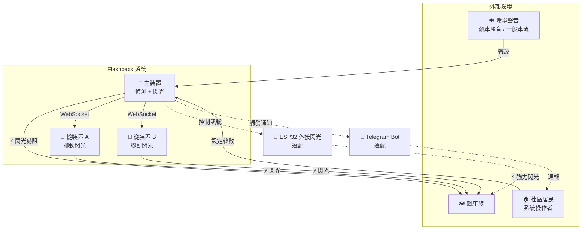
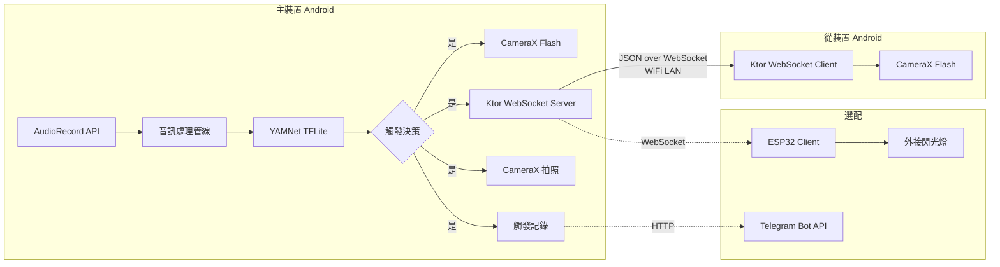

# 3. 系統範圍與上下文

## 3.1 業務上下文

### 業務上下文說明

| 通訊夥伴 | 輸入 | 輸出 |
|----------|------|------|
| 環境聲音 | PCM 音訊串流 | — |
| 飆車族 | —（被動角色） | 閃光嚇阻效果 |
| 社區居民 | 參數設定、安裝部署 | 觸發記錄、通知 |
| 從裝置 | — | WebSocket 觸發指令 |
| ESP32（選配） | — | 控制訊號 |
| Telegram（選配） | — | 觸發通知訊息 |

## 3.2 技術上下文

### 技術介面說明

| 介面 | 技術 | 協定 | 說明 |
|------|------|------|------|
| 音訊輸入 | AudioRecord API | PCM 16-bit | 低延遲音訊串流 |
| 裝置間通訊 | Ktor WebSocket | JSON over WS | 同一 WiFi LAN 內 |
| 閃光燈控制 | CameraX API | — | Android Camera2 封裝 |
| ML 推論 | TensorFlow Lite | — | YAMNet 模型，裝置端推論 |
| 外接控制（選配） | ESP32 WebSocket | JSON over WS | MicroPython |
| 通知（選配） | Telegram Bot API | HTTPS | 推播觸發事件 |

---

[<< 架構限制](02-architecture-constraints.md) | [目錄](00-index.md) | [解決方案策略 >>](04-solution-strategy.md)
