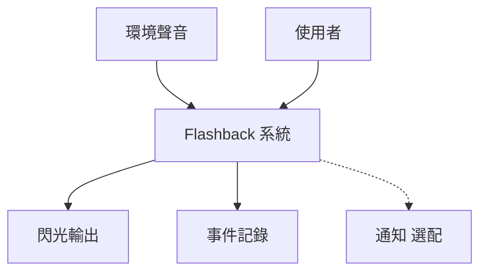
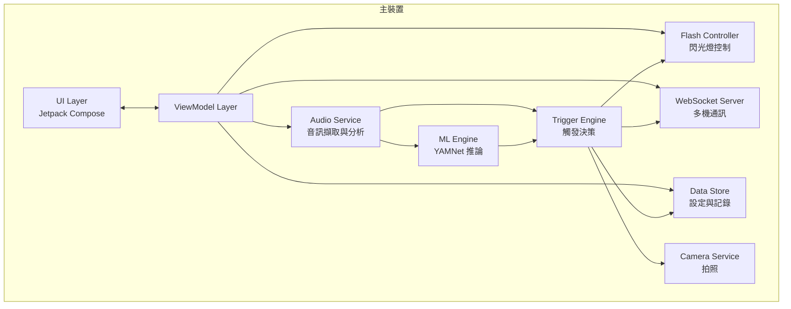
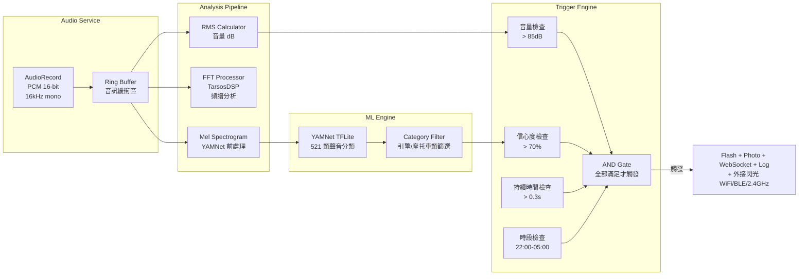

# 5. 建構區塊視圖

## 5.1 Level 0 — 系統整體

Flashback 系統接收環境聲音輸入，經過分析後決定是否觸發閃光輸出與事件記錄。

## 5.2 Level 1 — 主要元件

### 元件職責

| 元件 | 職責 | 狀態 |
|------|------|------|
| UI Layer | 顯示即時音量、頻譜、系統狀態；提供設定介面 | [IMPLEMENTED] 僅 scaffold |
| ViewModel Layer | 管理 UI 狀態、協調各 Service | [PLANNED] |
| Audio Service | 透過 AudioRecord 擷取 PCM 串流、計算 RMS、執行 FFT | [PLANNED] |
| ML Engine | 載入 YAMNet TFLite 模型、執行聲音分類推論 | [PLANNED] |
| Trigger Engine | 整合多重條件（AND 邏輯）判斷是否觸發 | [PLANNED] |
| Flash Controller | 控制手機閃光燈開關 | [PLANNED] |
| Camera Service | 觸發時拍照存檔 | [OPTIONAL] |
| WebSocket Server | 廣播觸發事件給從裝置 | [PLANNED] |
| Data Store | 持久化使用者設定與觸發記錄 | [PLANNED] |

## 5.3 Level 2 — 音訊處理管線（核心元件）

### 音訊處理規格

| 參數 | 值 | 說明 |
|------|-----|------|
| 取樣率 | 16,000 Hz | YAMNet 要求 |
| 位元深度 | 16-bit PCM | AudioRecord 標準格式 |
| 聲道 | Mono | 單聲道即可 |
| FFT 視窗 | 1024 samples | 約 64ms 一幀 |
| YAMNet 輸入 | 0.975 秒 | 15,600 samples per frame |
| 分析頻率 | ~10 FPS | 每秒約 10 次完整分析 |

---

[<< 解決方案策略](04-solution-strategy.md) | [目錄](00-index.md) | [執行期視圖 >>](06-runtime-view.md)
