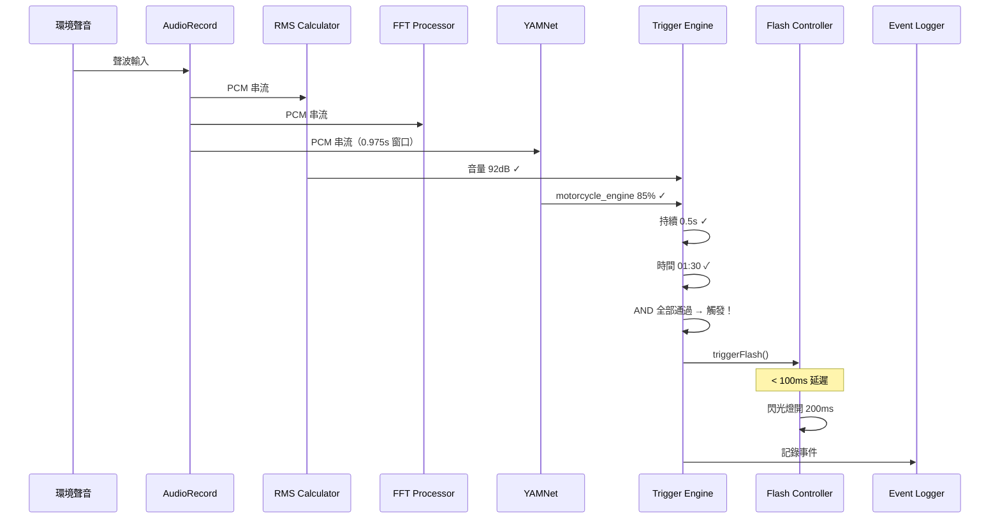
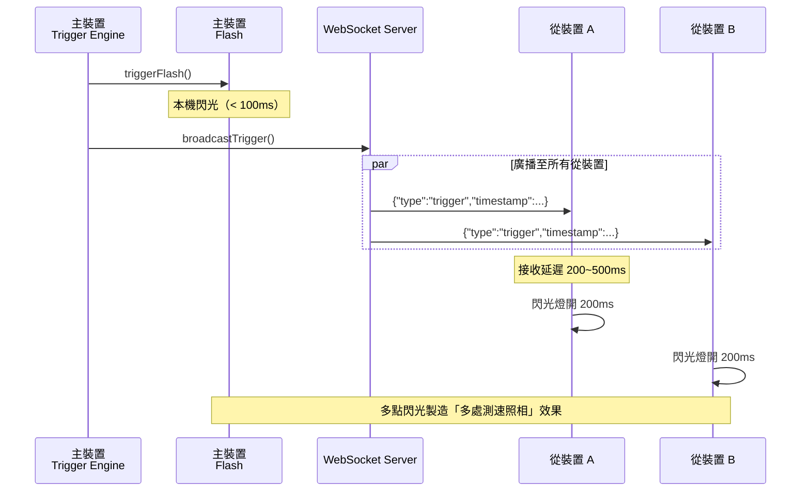
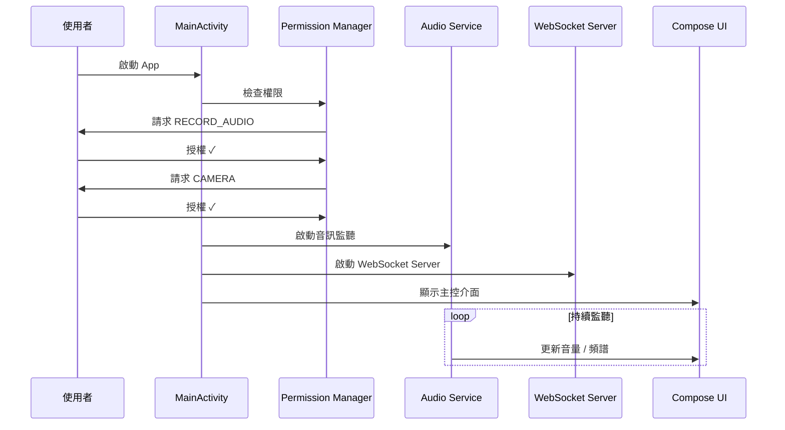
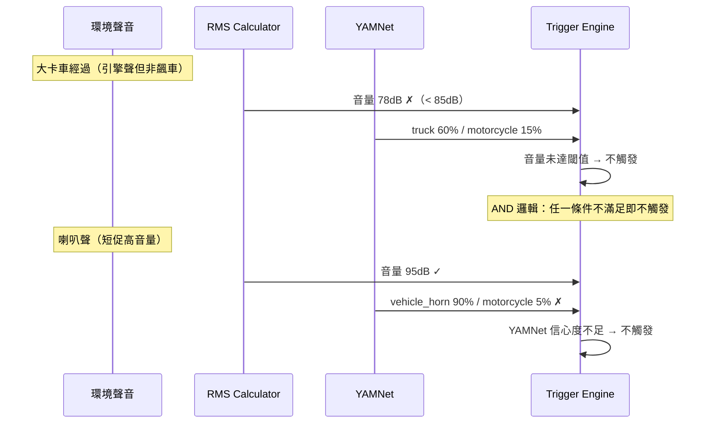

# 6. 執行期視圖

## 6.1 場景一：聲音偵測與閃光觸發（單機）

## 6.2 場景二：多機聯動閃光

## 6.3 場景三：應用程式啟動流程

## 6.4 場景四：非飆車聲音（不觸發）

---

[<< 建構區塊視圖](05-building-block-view.md) | [目錄](00-index.md) | [部署視圖 >>](07-deployment-view.md)
