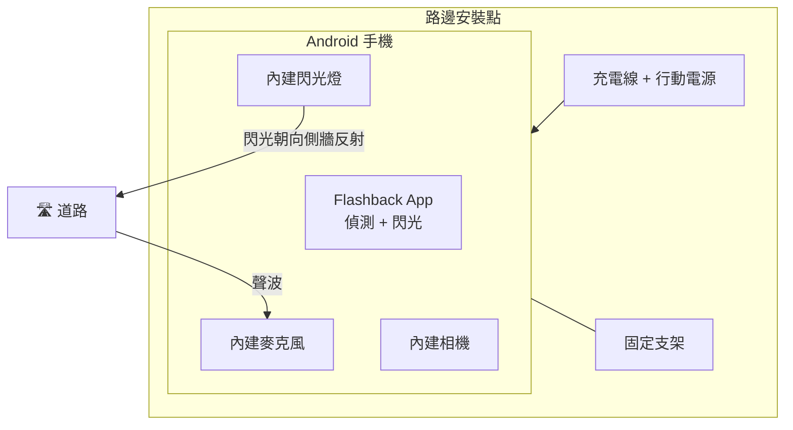
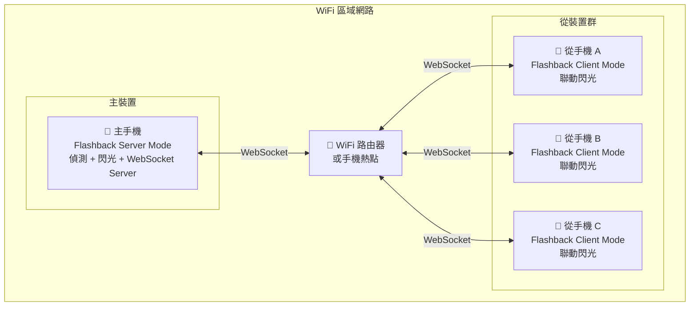
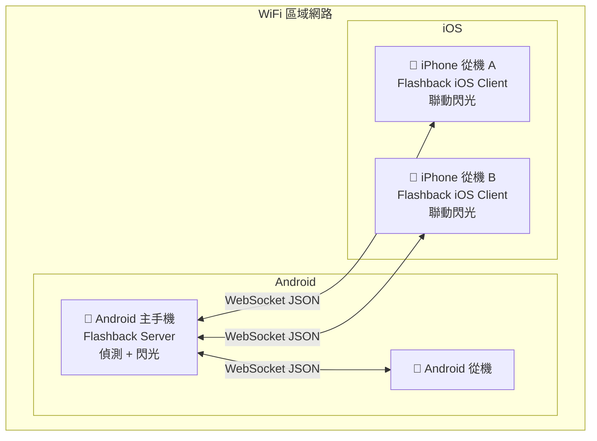
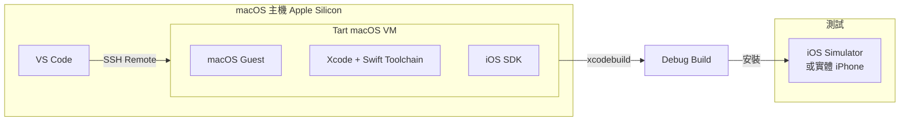

# 7. 部署視圖

## 7.1 單機部署（最小配置）



**適用場景：** 個人測試、單一監控點

**硬體需求：**
- Android 手機 × 1（Android 7.0+）
- 固定支架
- 充電線（長時間運作需持續供電）

## 7.2 多機聯動部署（建議配置）



**適用場景：** 社區聯防、多角度嚇阻

**硬體需求：**
- 主手機 × 1（偵測 + 閃光）
- 從手機 × 2~3（聯動閃光）
- 同一 WiFi 網路或手機熱點
- 各裝置配備固定支架與供電

## 7.3 外接閃光燈部署（三種方案）[OPTIONAL]

### 方案 A：WiFi 直連


- 閃光燈內建 WiFi，手機直接控制
- 無需額外硬體，延遲低
- 需閃光燈支援 WiFi 遙控協定

### 方案 B：Bluetooth 直連


- 閃光燈內建 Bluetooth（BLE），手機直接配對控制
- 無需額外硬體，省電
- 傳輸距離較短（約 10~30m）

### 方案 C：2.4GHz 經 ESP32 橋接


- 適用於內建 2.4GHz 無線觸發器的攝影棚閃光燈
- ESP32 作為橋接器：接收手機 BT/WiFi 指令，轉發 2.4GHz 射頻訊號
- 閃光功率最強，嚇阻效果最佳
- 需額外硬體：ESP32（約 NT$200）+ 2.4GHz 模組

### 外接閃光方案比較

| 方案 | 連線方式 | 額外硬體 | 預估成本 | 閃光功率 | 延遲 |
|------|---------|---------|---------|---------|------|
| A. WiFi 直連 | Phone → WiFi → Flash | 無 | NT$1,000~3,000 | 中 | 低 |
| B. BLE 直連 | Phone → BLE → Flash | 無 | NT$1,000~3,000 | 中 | 低 |
| C. 2.4GHz+ESP32 | Phone → BT/WiFi → ESP32 → 2.4GHz → Flash | ESP32 + 2.4GHz 模組 | NT$1,400~3,400 | 高 | 中 |

## 7.4 跨平台混合部署 [PLANNED]



**說明：** Android 與 iOS 裝置透過共通的 WebSocket JSON 協定通訊，iOS 裝置可作為從機加入聯動閃光網路。主裝置目前僅支援 Android（因 Ktor WebSocket Server）。

## 7.5 開發環境

```mermaid
graph LR
    subgraph 開發者機器
        subgraph Docker Container
            UBUNTU[Ubuntu 22.04]
            JDK[OpenJDK 17]
            GRADLE[Gradle 8.11.1]
            SDK[Android SDK 35]
        end
        VSCODE[VS Code<br/>+ Kotlin Extension<br/>+ Gradle Extension]
        VSCODE --> Docker Container
    end

    subgraph 測試
        EMU[Android Emulator<br/>或實體手機]
    end

    Docker Container -->|./gradlew assembleDebug| APK[Debug APK]
    APK -->|adb install| EMU
```

**開發環境規格：**

| 元件 | 版本 |
|------|------|
| 容器基礎 | Ubuntu 22.04 |
| JDK | OpenJDK 17 |
| Gradle | 8.11.1 |
| Android SDK | Platform 35, Build Tools 35.0.0 |
| IDE 擴充套件 | fwcd.kotlin, vscjava.vscode-gradle |

## 7.6 iOS 開發環境 [PLANNED]



**環境說明：**

| 元件 | 說明 |
|------|------|
| Host | macOS（Apple Silicon） |
| VM 工具 | [Tart](https://tart.run/)（Apple Virtualization.framework） |
| Guest OS | macOS（與 Host 相同或相近版本） |
| IDE | VS Code + SSH Remote（連線至 VM） |
| 建置工具 | Xcode + xcodebuild |

> 與 Android devcontainer 的開發體驗一致：開發者在 VS Code 中編輯程式碼，建置與執行在遠端環境（Docker 容器 / Tart VM）完成。唯一差異是 iOS 開發需在 macOS 上載入 VS Code。

---

[<< 執行期視圖](06-runtime-view.md) | [目錄](00-index.md) | [橫切關注點 >>](08-crosscutting-concepts.md)
