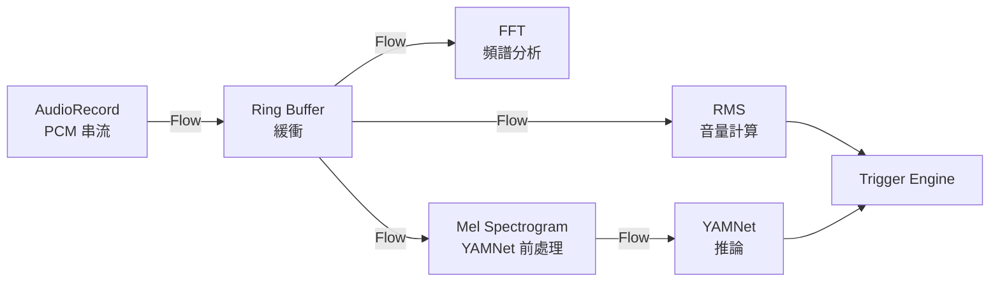

# 8. 橫切關注點

## 8.1 音訊管線（Audio Pipeline）

### 管線架構

音訊處理採用 **Kotlin Flow** 串流式管線，各階段非同步執行：



### 設計考量

- **Backpressure：** 使用 `conflate()` 或 `buffer(CONFLATED)` 避免緩衝區溢位，當下游處理不及時丟棄舊幀
- **執行緒：** 音訊擷取在獨立 thread，ML 推論在 `Dispatchers.Default`，UI 更新在 `Dispatchers.Main`
- **生命週期：** 管線綁定 Service lifecycle，App 移至背景時持續運作（Foreground Service）

## 8.2 並行模型（Concurrency Model）

### Kotlin Coroutine 架構

| Dispatcher | 用途 |
|-----------|------|
| `Dispatchers.IO` | 音訊擷取（AudioRecord 阻塞式讀取） |
| `Dispatchers.Default` | FFT 計算、YAMNet 推論（CPU 密集） |
| `Dispatchers.Main` | UI 更新、StateFlow 收集 |

### 關鍵 Coroutine Scope

```
Application Scope
├── AudioService Scope（Foreground Service）
│   ├── AudioRecord collector（IO）
│   ├── RMS calculator（Default）
│   ├── FFT processor（Default）
│   └── YAMNet inference（Default）
├── WebSocket Server Scope（IO）
└── ViewModel Scope（自動隨 lifecycle 取消）
```

### 共享狀態

- 使用 `StateFlow` / `SharedFlow` 在元件間傳遞資料
- 避免使用 mutable shared state
- 觸發事件使用 `SharedFlow(replay=0)` 確保不重複觸發

## 8.3 錯誤處理

| 場景 | 策略 |
|------|------|
| AudioRecord 初始化失敗 | 顯示錯誤訊息，引導使用者檢查權限 |
| YAMNet 模型載入失敗 | 降級為純音量偵測模式 |
| WebSocket 連線中斷 | 自動重連（exponential backoff），主機獨立運作不受影響 |
| 閃光燈不可用 | 記錄 log，僅執行其他觸發動作 |
| 外接閃光燈連線失敗 | 降級為手機內建閃光；記錄 warning |
| 音訊緩衝區溢位 | 丟棄最舊幀（conflate），記錄 warning |
| 儲存空間不足 | 停止拍照存檔，僅保留觸發記錄 |

## 8.4 電源管理

### 長時間運作策略

- 使用 **Foreground Service** 搭配 persistent notification，防止系統殺死背景程序
- 音訊擷取使用 **PARTIAL_WAKE_LOCK** 防止 CPU 休眠
- 螢幕可關閉，偵測持續運作
- 建議使用者連接充電線（8+ 小時運作耗電量大）

### 省電模式

- 未進入監聽時段（例如白天）自動停止音訊擷取
- 低音量環境下降低分析頻率（從 10 FPS 降至 2 FPS）
- FFT 與 YAMNet 僅在音量超過初步閾值時才啟動

## 8.5 權限模型

| 權限 | 用途 | 必要性 |
|------|------|--------|
| `RECORD_AUDIO` | 麥克風錄音 | 必要 |
| `CAMERA` | 閃光燈控制、拍照 | 必要 |
| `FOREGROUND_SERVICE` | 背景持續運作 | 必要 |
| `WAKE_LOCK` | 防止 CPU 休眠 | 必要 |
| `INTERNET` | WebSocket 通訊 | 多機模式必要 |
| `ACCESS_WIFI_STATE` | 取得 WiFi 資訊 | 多機模式必要 |
| `POST_NOTIFICATIONS` | 前景服務通知（Android 13+） | 必要 |
| `BLUETOOTH_CONNECT` | BLE 外接閃光燈（Android 12+） | 選配 |
| `BLUETOOTH_SCAN` | BLE 裝置掃描（Android 12+） | 選配 |
| `WRITE_EXTERNAL_STORAGE` | 儲存拍照（Android < 10） | 選配 |

### 權限請求策略

1. 啟動時僅請求核心權限（`RECORD_AUDIO`, `CAMERA`）
2. 使用功能時才請求額外權限（progressive permission request）
3. 權限被拒絕時提供說明並引導至設定頁面

## 8.6 日誌與監控

### 觸發事件記錄格式

```json
{
  "timestamp": "2026-02-28T01:30:00+08:00",
  "volume_db": 92.5,
  "yamnet_category": "motorcycle_engine",
  "yamnet_confidence": 0.85,
  "duration_ms": 520,
  "flash_triggered": true,
  "devices_notified": 2,
  "photo_path": "/storage/.../trigger_20260228_013000.jpg"
}
```

### 日誌分級

| 等級 | 用途 |
|------|------|
| DEBUG | 即時音量、FFT 數值（僅開發模式） |
| INFO | 觸發事件、系統狀態變更 |
| WARN | 緩衝區溢位、WebSocket 重連 |
| ERROR | 權限被拒、硬體不可用 |

---

[<< 部署視圖](07-deployment-view.md) | [目錄](00-index.md) | [架構決策紀錄 >>](09-architecture-decisions.md)
