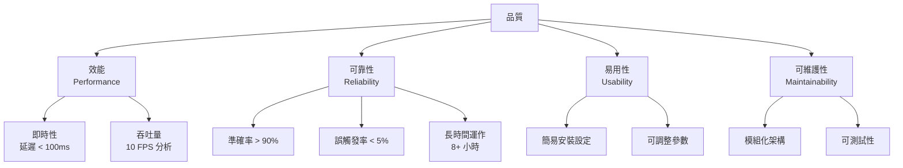

# 10. 品質需求

## 10.1 品質樹

## 10.2 品質場景

### 效能（Performance）

| ID | 場景 | 刺激 | 回應 | 度量 |
|----|------|------|------|------|
| QS-1 | 本機閃光延遲 | 飆車聲音被偵測到 | 閃光燈觸發 | 從聲音到達麥克風到閃光啟動 < 100ms |
| QS-2 | 多機閃光延遲 | 主機觸發閃光 | 從機接收並閃光 | 從主機觸發到從機閃光 < 500ms |
| QS-3 | 分析吞吐量 | 持續音訊輸入 | 完成偵測分析 | 每秒完成約 10 次完整分析週期 |
| QS-4 | YAMNet 推論時間 | 0.975 秒音訊幀 | 分類結果 | 單次推論 < 50ms（中階手機） |

### 可靠性（Reliability）

| ID | 場景 | 刺激 | 回應 | 度量 |
|----|------|------|------|------|
| QS-5 | 飆車聲音辨識 | 飆車族通過（引擎聲 > 85dB） | 正確辨識並觸發 | 辨識率 > 90% |
| QS-6 | 正常車流不觸發 | 一般汽機車通過 | 不觸發 | 誤觸發率 < 5% |
| QS-7 | 環境噪音不觸發 | 雷聲、施工聲、喇叭聲 | 不觸發 | 誤觸發率 < 5% |
| QS-8 | 長時間穩定 | 系統連續運作 8 小時 | 無 crash、無記憶體洩漏 | Uptime 100% |
| QS-9 | WebSocket 斷線恢復 | 從機網路中斷 | 自動重連 | 重連時間 < 5 秒 |

### 易用性（Usability）

| ID | 場景 | 刺激 | 回應 | 度量 |
|----|------|------|------|------|
| QS-10 | 首次設定 | 非技術人員安裝 App | 完成設定並開始監聽 | 設定步驟 < 5 步 |
| QS-11 | 參數調整 | 使用者想調整靈敏度 | 透過 UI 調整閾值 | 即時生效，無需重啟 |
| QS-12 | 觸發回顧 | 使用者想查看歷史記錄 | 顯示觸發清單 | 含時間、音量、照片 |

### 可維護性（Maintainability）

| ID | 場景 | 刺激 | 回應 | 度量 |
|----|------|------|------|------|
| QS-13 | 新增觸發條件 | 開發者想加入新的判斷條件 | 修改 Trigger Engine | 不影響其他模組 |
| QS-14 | 替換 ML 模型 | 從 YAMNet 換成自訓模型 | 替換 ML Engine 實作 | 僅需修改 ML Engine 模組 |
| QS-15 | 新增通知管道 | 新增 LINE Notify 等 | 加入新的 Notifier | 不影響觸發邏輯 |

---

[<< 架構決策紀錄](09-architecture-decisions.md) | [目錄](00-index.md) | [風險與技術債 >>](11-risks-and-technical-debts.md)
